# Task Manager

A full-stack task management application with a React + Vite frontend and an Express/MongoDB backend.

This README documents the actual repository layout, how to run both apps, the expected environment variables, and the REST API endpoints (with examples) so you or other developers can get started quickly.

## Table of contents

- Project structure
- Technologies
- Prerequisites
- Setup & run (dev)
- Environment variables
- Detailed API (endpoints, request/response shapes)
- File upload notes
- Where to find code
- Contributing
- License

## Project structure (actual)

Snapshot of the repository folder tree (useful when navigating the project):

```
Root
├─ README.md
├─ backend/
│  ├─ .env
│  ├─ config/
│  │  └─ db.js
│  ├─ controllers/
│  │  ├─ authController.js
│  │  ├─ reportController.js
│  │  ├─ taskController.js
│  │  └─ userController.js
│  ├─ middlewares/
│  │  ├─ authMiddleware.js
│  │  └─ uploadMiddleware.js
│  ├─ models/
│  │  ├─ Task.js
│  │  └─ User.js
│  ├─ routes/
│  │  ├─ authRoutes.js
│  │  ├─ reportRoutes.js
│  │  ├─ taskRoutes.js
│  │  └─ userRoutes.js
│  ├─ uploads/
│  ├─ package.json
│  ├─ package-lock.json
│  └─ server.js
└─ frontend/
    ├─ .gitignore
    ├─ eslint.config.js
    ├─ index.html
    ├─ package.json
    ├─ package-lock.json
    ├─ public/
    ├─ README.md
    ├─ src/
    │  ├─ App.jsx
    │  ├─ index.css
    │  ├─ main.jsx
    │  ├─ assets/
    │  │  └─ images/
    │  ├─ components/
    │  │  ├─ AvatarGroup.jsx
    │  │  ├─ DeleteAlert.jsx
    │  │  ├─ Modal.jsx
    │  │  ├─ Progress.jsx
    │  │  ├─ TaskListTable.jsx
    │  │  ├─ TaskStatusTabs.jsx
    │  │  └─ Cards/
    │  │     ├─ CharAvatar.jsx
    │  │     ├─ InfoCard.jsx
    │  │     ├─ TaskCard.jsx
    │  │     └─ UserCard.jsx
    │  ├─ Charts/
    │  │  ├─ CustomBarChart.jsx
    │  │  ├─ CustomLengend.jsx
    │  │  ├─ CustomPieChart.jsx
    │  │  └─ CustomTooltip.jsx
    │  ├─ Inputs/
    │  │  ├─ AddAttachmentsInput.jsx
    │  │  ├─ Input.jsx
    │  │  ├─ ProfilePhotosSelector.jsx
    │  │  ├─ SelectDropDown.jsx
    │  │  ├─ SelectUsers.jsx
    │  │  └─ TodoListInput.jsx
    │  ├─ layout/
    │  │  ├─ AuthLayout.jsx
    │  │  ├─ DashboardLayout.jsx
    │  │  ├─ Navbar.jsx
    │  │  └─ SideMenu.jsx
    │  ├─ context/
    │  │  └─ userContext.jsx
    │  ├─ hooks/
    │  │  └─ UseUserAuth.jsx
    │  ├─ pages/
    │  │  ├─ Admin/
    │  │  │  ├─ AdminDashboard.jsx
    │  │  │  ├─ CreateTask.jsx
    │  │  │  ├─ ManageTasks.jsx
    │  │  │  └─ ManageUsers.jsx
    │  │  ├─ Auth/
    │  │  │  ├─ Login.jsx
    │  │  │  └─ SignUp.jsx
    │  │  └─ User/
    │  │     ├─ MyTasks.jsx
    │  │     ├─ UserDashboard.jsx
    │  │     └─ ViewTaskDetails.jsx
    │  ├─ routes/
    │  │  └─ PrivateRoute.jsx
    │  └─ utils/
    │     ├─ apiPaths.js
    │     ├─ axiosInstance.js
    │     ├─ data.js
    │     ├─ helper.js
    │     └─ uploadImage.js
    └─ vite.config.js
```

## Technologies

- Backend: Node.js, Express, Mongoose (MongoDB), Multer (file uploads), JSON Web Tokens (auth)
- Frontend: React, Vite, Axios, Tailwind (utilities), Recharts, react-router

## Prerequisites

- Node.js (14+ recommended)
- npm
- A running MongoDB instance (local or cloud)

## Setup & run (development)

Open two terminals (one for backend, one for frontend). Commands shown for PowerShell on Windows.

1) Backend

```powershell
cd backend
npm install        # first-time only
npm run dev        # starts nodemon server (script: "dev": "nodemon server.js")
```

Default backend behavior from `server.js`:

- Loads environment variables via `dotenv`
- Connects to MongoDB using `MONGO_URI` (see Environment variables below)
- Serves the API under `/api` and static uploads from `/uploads`
- Default port: `process.env.PORT || 5000` (so typically `5000`)

2) Frontend

```powershell
cd frontend
npm install        # first-time only
npm run dev        # starts Vite dev server (script: "dev": "vite")
```

Vite usually runs on `http://localhost:5173` by default. If the frontend is served from a different host/port, set `CLIENT_URL` in the backend to allow CORS.

## Environment variables

Create a `.env` file in `backend/` with at least the following values:

- `MONGO_URI` — your MongoDB connection string (required)
- `JWT_SECRET` — secret used to sign JSON Web Tokens (required)
- `PORT` — optional, the port the backend listens on (defaults to `8000`)
- `CLIENT_URL` — optional, allowed origin for CORS (defaults to `*`)

Example `backend/.env`:

```
MONGO_URI=mongodb://localhost:27017/task-manager
JWT_SECRET=replace_with_a_secure_random_string
PORT=8000
CLIENT_URL=http://localhost:5173
```

## API — Overview and endpoints

Base URL (dev): http://localhost:8000 (or `http://localhost:<PORT>` if you set `PORT`).

All API routes are prefixed with `/api` (see `server.js`). Authentication uses JWT bearer tokens. Include the header:

```
Authorization: Bearer <token>
```

Below are the routes defined in `backend/routes/` with required auth and brief payload notes.

### Auth — `/api/auth`

- POST `/api/auth/register` — Public
    - Body (JSON): { name, email, password }
    - Response: typically created user + token

- POST `/api/auth/login` — Public
    - Body (JSON): { email, password }
    - Response: { token, user }

- GET `/api/auth/profile` — Protected
    - Returns the authenticated user's profile

- PUT `/api/auth/profile` — Protected
    - Update profile fields (e.g., name, email, password)

- POST `/api/auth/upload-image` — Public (file upload)
    - Accepts `multipart/form-data` with field `image`
    - Returns: { imageUrl } pointing to `/uploads/<filename>`

### Users — `/api/users`

- GET `/api/users` — Protected, admin only
    - Returns list of users (requires admin privileges per route middleware)

- GET `/api/users/:id` — Protected
    - Returns the specified user by id

Note: `userRoutes.js` currently exposes read-only endpoints (no create/delete in the routes). See `backend/controllers/userController.js` for behavior.

### Tasks — `/api/tasks`

The task routes include list, CRUD, status updates, and dashboard helpers.

- GET `/api/tasks/dashboard-data` — Protected
    - Returns aggregated dashboard stats (used by admin dashboard)

- GET `/api/tasks/user-dashboard-data` — Protected
    - Returns user-specific dashboard stats

- GET `/api/tasks` — Protected
    - Returns tasks (controller may scope results based on user/admin role)

- GET `/api/tasks/:id` — Protected
    - Returns a single task by id

- POST `/api/tasks` — Protected, admin only
    - Create a new task (admin-only per route middleware)
    - Body (JSON): example fields: title, description, dueDate, priority, assignedTo

- PUT `/api/tasks/:id` — Protected
    - Update task fields

- DELETE `/api/tasks/:id` — Protected, admin only
    - Delete a task

- PUT `/api/tasks/:id/status` — Protected
    - Update only the `status` field (e.g., pending → in-progress → done)

- PUT `/api/tasks/:id/todo` — Protected
    - Update task checklist/todo items (controller handles structure)

Example create task payload:

```json
{
    "title": "Finish report",
    "description": "Compile sales figures",
    "dueDate": "2025-12-01",
    "priority": "high",
    "assignedTo": "<userId>"
}
```

### Reports — `/api/reports`

- GET `/api/reports/export/tasks` — Protected, admin only
    - Exports tasks report (likely returns downloadable Excel/CSV via `exceljs`)

- GET `/api/reports/export/users` — Protected, admin only
    - Exports users report

### File uploads and static files

- Uploaded files are stored in `backend/uploads/` and served statically at `/uploads/<filename>`.
- Use `multipart/form-data` for file uploads. Multer is configured in `backend/middlewares/uploadMiddleware.js`.

---

If you want, I can now add a `backend/.env.example` and a `README-API.md` that lists these endpoints in a machine-friendly table or generate an OpenAPI (Swagger) spec from the controllers.

## Where to find key code

- Route definitions: `backend/routes/*.js` (`authRoutes.js`, `userRoutes.js`, `taskRoutes.js`, `reportRoutes.js`)
- Controllers: `backend/controllers/*.js`
- Models: `backend/models/*.js`
- Middlewares: `backend/middlewares/*.js` (auth, upload)

## Development notes & tips

- CORS: `server.js` uses `CLIENT_URL` (or `*`) to configure allowed origins. If frontend can't reach backend due to CORS, ensure `CLIENT_URL` matches your Vite dev server origin.
- If MongoDB fails to connect, check `MONGO_URI` and ensure your DB is reachable.
- JWT tokens are issued at login; protect routes by sending `Authorization: Bearer <token>`.

## Contributing

Contributions are welcome. Suggested small improvements:

- Add README sections per each backend route with exact request/response examples
- Add automated tests for backend routes
- Add environment-specific config and example `.env.example`

When opening a PR, include:

- Short summary of change
- Any setup steps to run locally

---

If you'd like, I can also:

- add a `backend/.env.example` file with the variables above,
- add a small `README-API.md` generated from the actual route files, or
- create a Postman / OpenAPI (swagger) spec for the API.

Tell me which follow-up you'd like and I'll proceed.

## Screenshots
```
POV: Admin
```
### Dashboard Overview
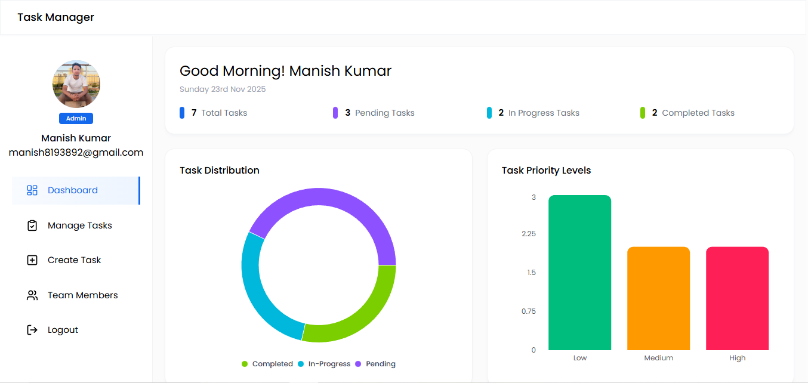
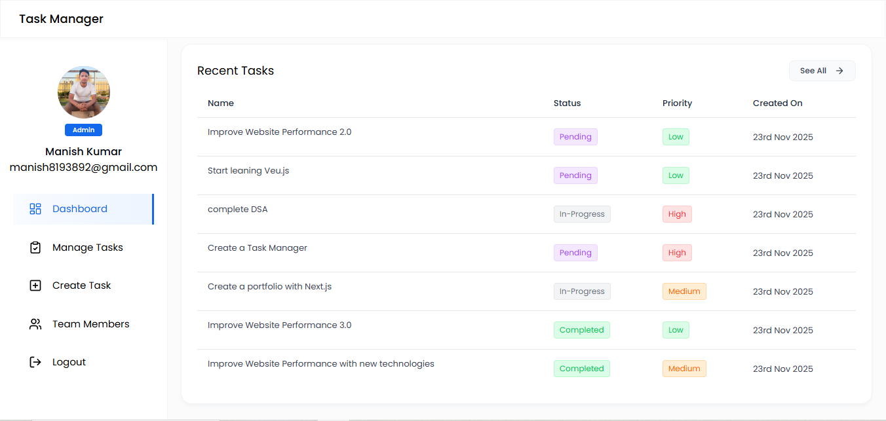

### Manage Tasks
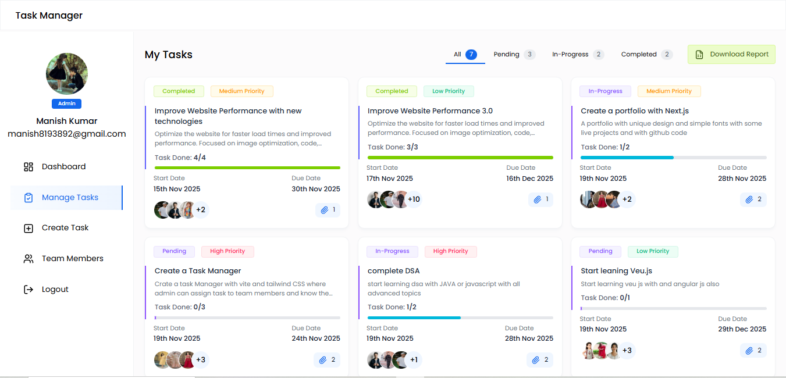

### Create Task
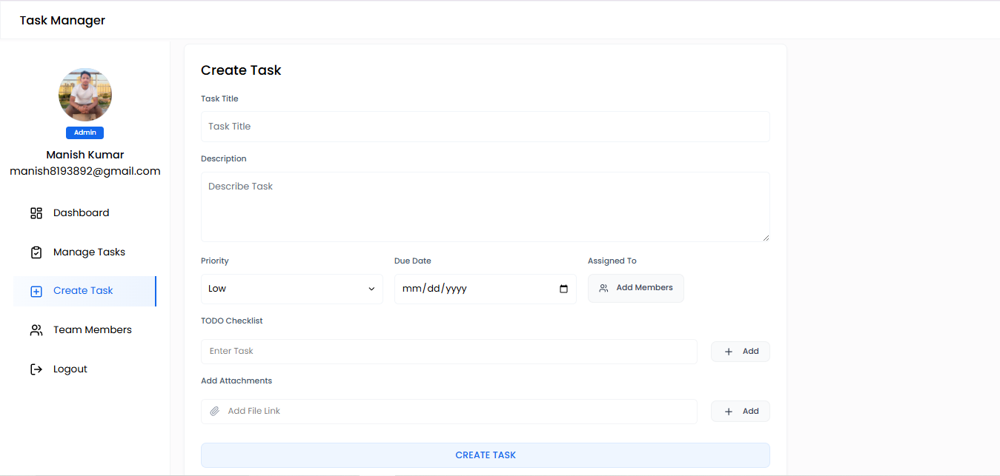

### When the admin clicks Assigned To, a popup displays user details, allowing the admin to select users to assign the task.
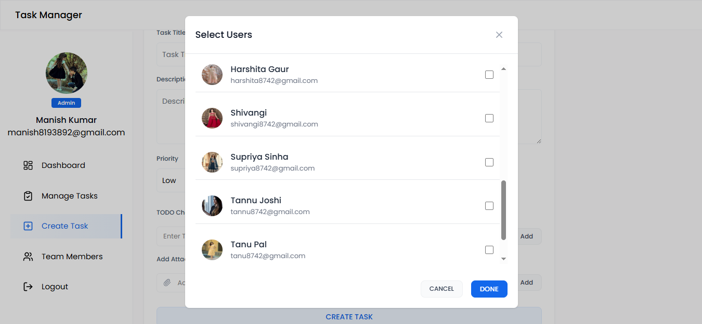

### Team Members
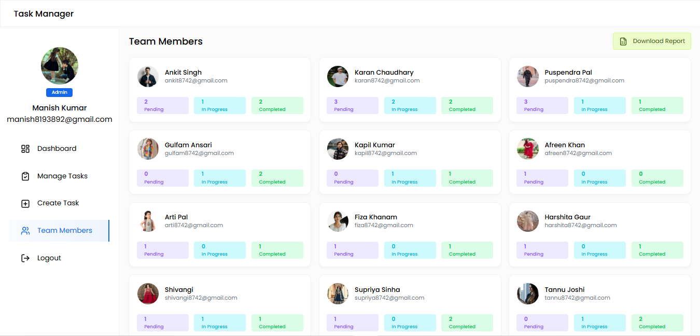

```
POV: member
```

### Dashboard Overview

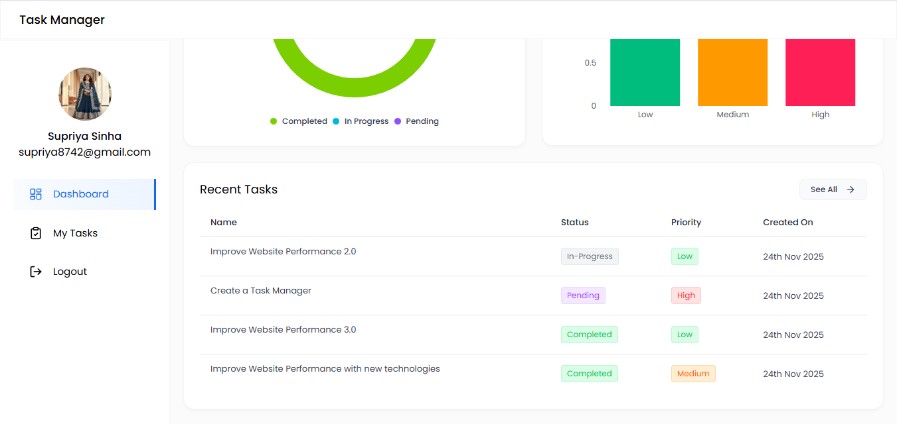

### My Tasks
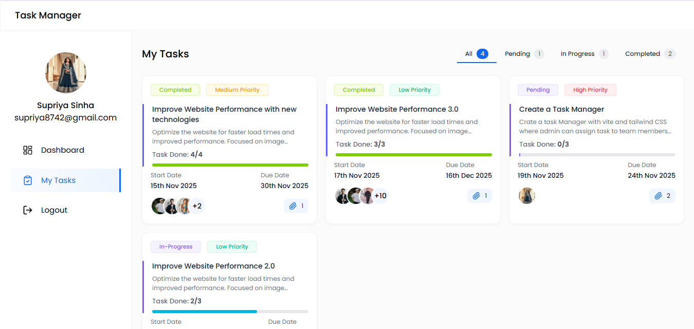

### When a member opens an assigned task, its details pop up. Completing the to-do checklist updates the task status.
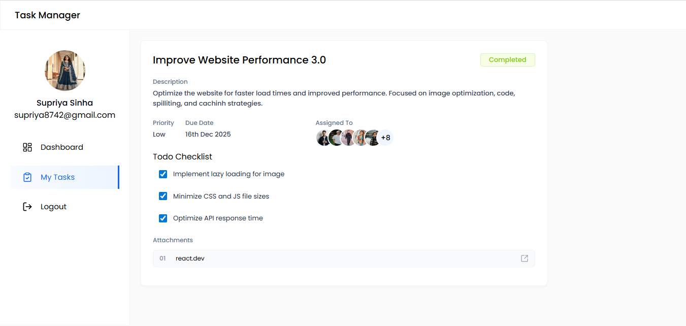

### Login Page
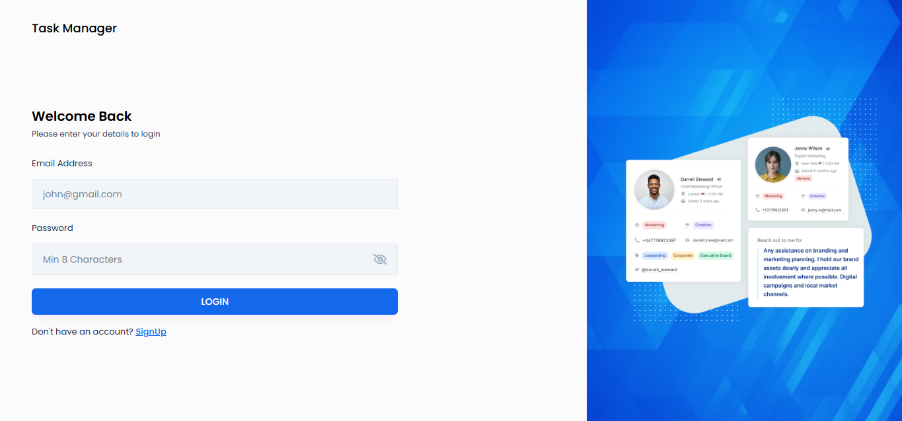
### Sign Up Page
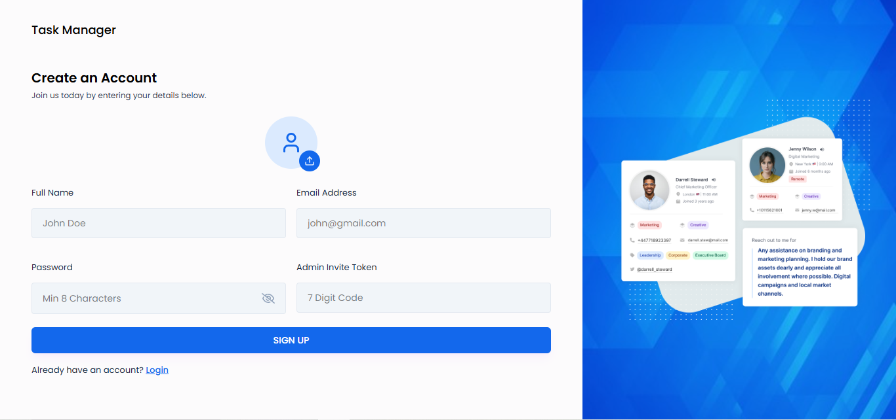

## © Copyright
**© 2025 All right reserved. ~ This project is Designed and Developed by `Manish Kumar`.**